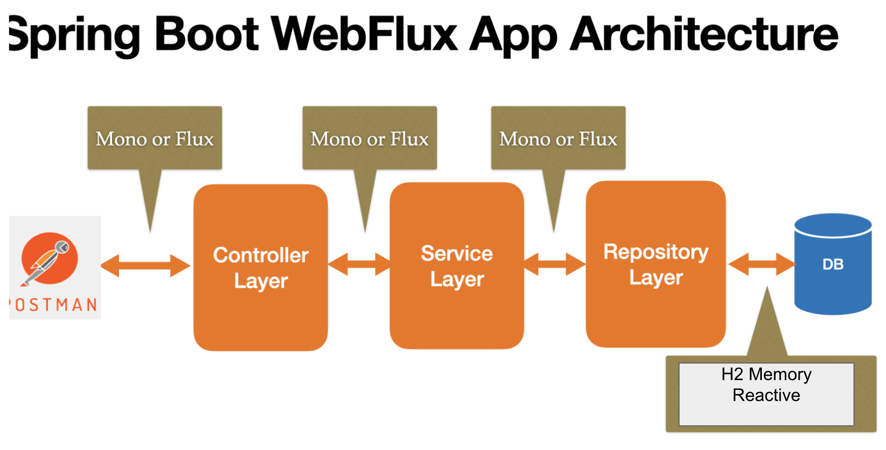

---

# 📘 API REST con Spring Boot 3 y Autenticación JWT
Esta API RESTful desarrollada con Spring Boot 3 implementa autenticación mediante JSON Web Tokens (JWT) y permite el registro de nuevos usuarios


## 🚀 Endpoints Disponibles

### 1. 🔐 Autenticación de Usuario

- *URL*: `POST /auth/login`

- *Descripción*: Autentica a un usuario existente y genera un token JWT para su uso en solicitudes protegids.

- **Cuerpo de la solicitud (JSON)**:
  
```json
  {
    "email": "juan@rodriguez.org",
    "password": "Password1"
  }
```


- **Respuesta exitosa (200 OK)**:
  
```json
  {
    "token": "eyJhbGciOiJIUzI1NiJ9..."
  }
```

- **Notas**:

 - El usuario con correo `juan@rodriguez.org` y contraseña `Password1` se carga automáticamente al iniciar la aplicacin.

### 2. 🧾 Registro de Nuevo Usuario

- **URL*: `POST /api/users`

- **Descripción*: Registra un nuevo usuario en el sistma.

- **Requiere Autenticación*: Sí (Incluir el token JWT en el encabezado `Authorizatio`).

- **Encabezados**:

 - `Authorization: Bearer <token>`

- **Cuerpo de la solicitud (JSON)**:
  
```json
  {
    "name": "Juan Rodriguez",
    "email": "juan@rodriguez0.org",
    "password": "Password1",
    "phones": [
      {
        "number": "1234567",
        "cityCode": "1",
        "countryCode": "57"
      }
    ]
  }
```


- **Respuesta exitosa (201 Created)**:
  
```json
  {
    "id": "uuid-generado",
    "name": "Juan Rodriguez",
    "email": "juan@rodriguez0.org",
    "created": "2025-04-14T00:00:00Z",
    "modified": "2025-04-14T00:00:00Z",
    "lastLogin": "2025-04-14T00:00:00Z",
    "token": "eyJhbGciOiJIUzI1NiJ9...",
    "isActive": true
  }
```


## 🛠️ Configuración Inicial

- **Puerto por defecto**: `8080`

- **Base URL**: `http://localhost:8080`

- **Usuario precargado**:
  - Email: `juan@rodriguezorg`
  - Contraseña: `Passwrd1`

## 🔐 Seguridad y Autenticacin

- La autenticación se maneja mediant JWT.

- Para acceder a endpoints protegidos, incluye el token JWT en el encabezado `Authorization` de la siguiente mnera:

  
```
Authorization: Bearer <token>
 ```


## 🧪 Pruebas con Postman
[smartjob.postman_collection.json](smartjob.postman_collection.json)

1. **Autenticación**:
   - Realiza una solicitud `POST` a `/auth/login` con el cuerpo de la solicitud proporcionado anteriomente.
   - Guarda el token recibido de la resuesta.

2. **Registro de Usuario**:
   - Realiza una solicitud `POST` a `/api/users`.
   - Incluye el token en el encabezado `Authorization` como se muestra en la sección de segridad.
   - Proporciona el cuerpo de la solicitud con los detalles del nuevo uuario.


---

